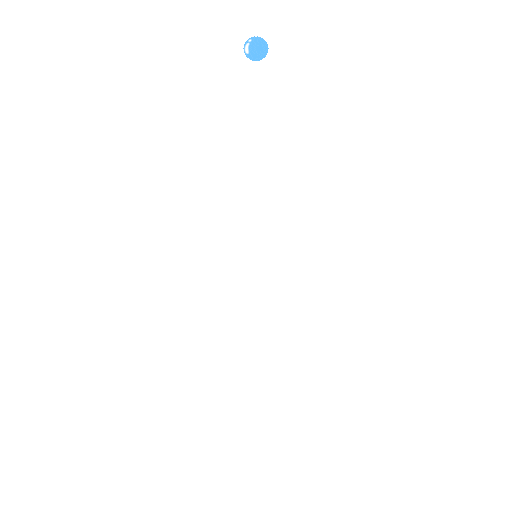
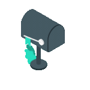

    

<h1 align="center">Hello , welcome to my corner of GitHub.</h1>

    

    

<ul align="left">
  <li>
    &nbsp;&nbsp;&nbsp;<b>I’m currently learning</b> Merkle proofs, advanced smart contract security, and gas optimizations.
  </li>
  <li>
    &nbsp;&nbsp;&nbsp;<b>I’m looking to collaborate on</b> Web3 projects, Telegram Mini Apps, and automation solutions.
  </li>
  <li>
    &nbsp;&nbsp;&nbsp;<b>I’m looking for help with</b> <a href="https://t.me/DevCollab">Expanding my developer community on Telegram</a>.
  </li>
  <li>
     <b>All of my projects are available at</b> <a href="https://t.me/StellaShowcase">@StellaShowcase</a>.
  </li>
  <li>
     <b>Ask me about</b> MERN stack, Next.js, TypeScript, smart contracts, automation workflows, Telegram bots.
  </li>
  <li>
     <b>Reach me at</b> <a href="mailto:nextblock.dev@gmail.com">nextblock.dev@gmail.com</a> or <a href="https://t.me/StellaRay777">@StellaRay777</a>
  </li>
  <li>
    &nbsp;&nbsp;&nbsp;<b>Fun fact:</b> I automate things just to avoid doing them manually once.
  </li>
</ul>

<table align="center">
  <tr>
    <td align="center" width="103">
       React
    </td>
    <td align="center" width="103">
       Redux
    </td>
    <td align="center" width="103">
       Next.js
    </td>
    <td align="center" width="103">
       Nuxt.js
    </td>
    <td align="center" width="103">
       Flutter
    </td>
    <td align="center" width="103">
       Nest.js
    </td>
    <td align="center" width="103">
       Node.js
    </td>
    <td align="center" width="103">
       Express
    </td>
  </tr>
  <tr>
    <td align="center" width="103">
       TypeScript
    </td>
    <td align="center" width="103">
       Python
    </td>
    <td align="center" width="103">
       Django
    </td>
    <td align="center" width="103">
       REST API
    </td>
    <td align="center" width="103">
       Solidity
    </td>
    <td align="center" width="103">
       Three.js
    </td>
    <td align="center" width="103">
       D3.js
    </td>
    <td align="center" width="103">
       Material UI
    </td>
  </tr>
  <tr>
    <td align="center" width="103">
       Tailwind
    </td>
    <td align="center" width="103">
       Sass
    </td>
    <td align="center" width="103">
       Bootstrap
    </td>
    <td align="center" width="103">
       AWS
    </td>
    <td align="center" width="103">
       MongoDB
    </td>
    <td align="center" width="103">
       MySQL
    </td>
    <td align="center" width="103">
       PostgreSQL
    </td>
     <td align="center" width="103">
       SQLite
    </td>
  </tr>
</table>

    

 
 

     

